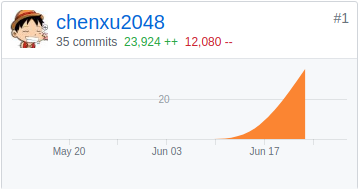
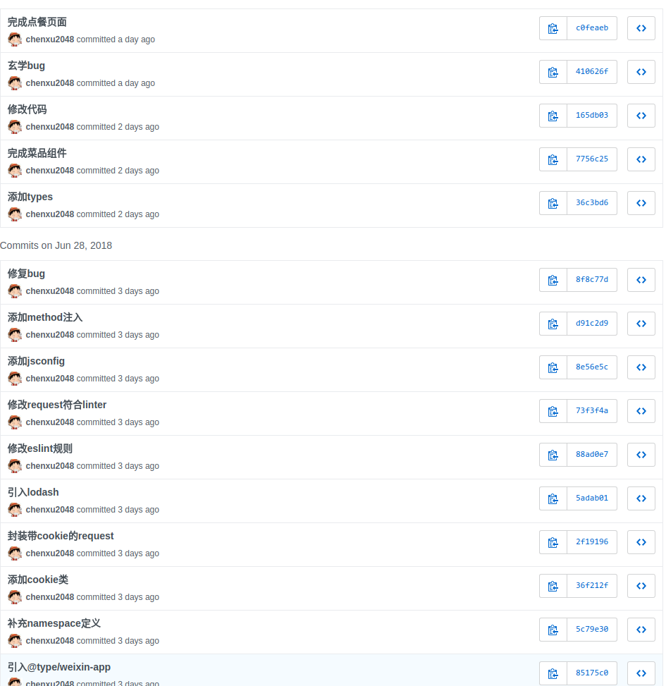
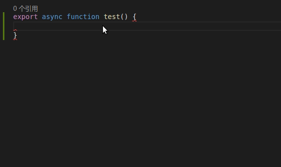

# Final Report
- PSP 2.1 统计表

| 项目 | 时间 |
|-|-|
|**计划**|5|
|估计任务所需时间|5|
|**开发**|69|
|需求分析|10|
|生成设计文档|4|
|设计复审|5|
|代码规范|6|
|具体设计|11|
|具体编码|22|
|代码复审|5|
|测试|5|
|**报告**|7|
|测试报告|3|
|计算工作量|1|
|事后总结，提出改进计划|3|

### GIT统计报告

### 最有价值
使用ts的type declare配合vscode的JSDoc实现代码补全，个人觉得极大地提高了工作效率，可以直接补全出小程序接口以及自己添加的封装，如图

### 博客
参考X2
